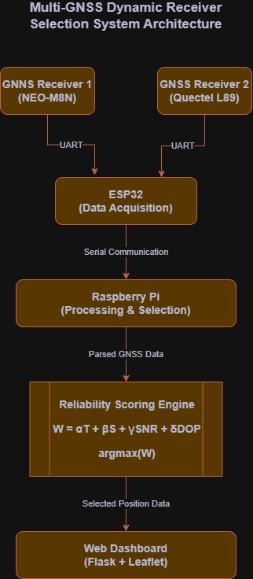

# 🚀 Multi-GNSS Dynamic Receiver Selection System


---

A low-cost, real-time embedded system that evaluates and dynamically selects the most reliable GNSS receiver using multi-parameter scoring.

---

## 📌 Overview

This project implements a **multi-receiver GNSS reliability assessment system** using an **ESP32** and **Raspberry Pi 4**. It continuously analyzes data from two GNSS receivers and selects the most reliable positioning source in real time.

---

## 🧠 System Architecture



```
GNSS Receivers → ESP32 → Raspberry Pi → Scoring Algorithm → Web Dashboard
```

---

## ⚙️ Key Features

- 📡 Multi-receiver GNSS data acquisition  
- 🔄 Real-time receiver selection (1 Hz)  
- 📊 Reliability scoring using multiple parameters  
- 🌍 Live visualization on web dashboard  
- 💻 Lightweight embedded implementation  
- 💰 Low-cost system (< ₹2000 hardware)

---

## 🧠 Methodology

Each GNSS receiver is evaluated using:

```
W = αT + βS + γSNR + δDOP
```

Where:

- **T** → Time accuracy  
- **S** → Satellite count  
- **SNR** → Signal-to-noise ratio  
- **DOP** → Dilution of Precision (inverted)  

All parameters are normalized to **0–1 range**.

### Selection Rule:

```
Best Receiver = argmax(W)
```

---

## 🏗️ System Architecture

```
GNSS Receivers → ESP32 → Raspberry Pi → Scoring Algorithm → Web Dashboard
```

### Components:

- **ESP32** → Data acquisition (UART)  
- **Raspberry Pi 4** → Processing & decision making  

### GNSS Modules:

- NEO-M8N (GPS)  
- Quectel L89 (Multi-constellation)

---

## ⚙️ Setup Instructions (IMPORTANT)

### 1️⃣ Clone the Repository

```bash
git clone https://github.com/Sanal-Sivakumar/gnss-dynamic-selection.git
cd gnss-dynamic-selection/raspberrypi
```

---

### 2️⃣ Create Virtual Environment

```bash
python -m venv venv
```

#### Activate:

**Windows**
```bash
venv\Scripts\activate
```

**Linux / Mac**
```bash
source venv/bin/activate
```

---

### 3️⃣ Install Dependencies

```bash
pip install -r requirements.txt
```

---

### 4️⃣ Run the Server

```bash
python server.py
```

---

### 5️⃣ Open Dashboard

Open in browser:

```
http://127.0.0.1:5000
```

---

## 🔌 ESP32 Setup

1. Open `esp32_gnss.ino` in Arduino IDE  
2. Install required library:
   - **TinyGPSPlus**
3. Select correct board and COM port  
4. Upload code to ESP32  

---

## 📊 Dashboard

- Real-time map visualization  
- Active receiver display  
- Live metrics:
  - Satellite count  
  - SNR  
  - DOP  
  - Reliability score  

---

## ⚡ Tech Stack

- ESP32 (Arduino / C++)
- Python (Raspberry Pi)
- Flask (Web server)
- PySerial (UART communication)
- Leaflet.js (Map UI)

---

## 🧪 Applications

- Autonomous navigation  
- Precision agriculture  
- Fleet tracking  
- GNSS reliability research  

---

## 🔍 Key Contribution

- Real-time cross-receiver GNSS selection  
- Works on low-cost embedded hardware  
- Avoids complex sensor fusion  

---

## 🚧 Future Work

- Adaptive weight tuning  
- IMU integration (fallback navigation)  
- Higher update rates (5–10 Hz)  
- Data logging & analytics  

---

## 🙌 Acknowledgment

Developed as part of PNT Lab research work focused on low-cost GNSS reliability systems.

---

## 📎 License

MIT License